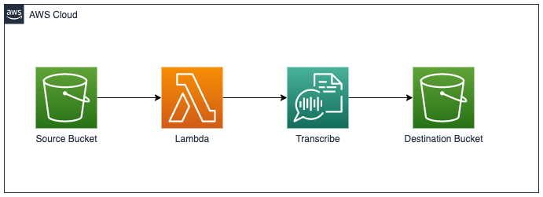
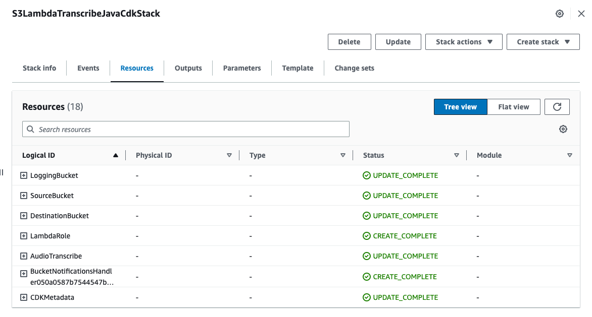

# Audio to Text using Amazon Transcribe

Java AWS CDK application to convert audio files to text using Amazon Transcribe.

## Architecture



## Description

Serverless application that converts audio files to text using Amazon Transcribe.

Source Bucket - S3 bucket where audio files are uploaded.
Lambda Function - Lambda function that is triggered when an audio file is uploaded to the source bucket. The function converts the audio file to text using Amazon Transcribe and stores the result in the destination bucket.
Transcribe - Amazon Transcribe job that converts the audio file to text.
Destination Bucket - S3 bucket where the text file is stored.


## Pre-requisites

* AWS Account
* Java 17 or later
```
java -version
```
* Maven 3.0 or later
```
mvn -version
```
* AWS CLI
```
aws --version
```

* Node.js 18.x or later
```
node -v
```

* AWS CDK - Install the [AWS CDK Toolkit](https://docs.aws.amazon.com/cdk/v2/guide/cli.html) globally using the following command:
```
npm install -g aws-cdk
```
```
cdk --version
```
* CDK Bootstrap - Bootstrap your AWS account for CDK. This only needs to be done once per account/region.
```
cdk bootstrap aws://<account>/<region>
```

## Installation

Clone the repository and navigate to the project directory.
```
git clone https://github.com/aws-samples/amazon-s3-lambda-transcribe-java-cdk.git
cd amazon-s3-lambda-transcribe-java-cdk
```

## Build
Run below build command from the root directory of the project. 
```
mvn clean install
```

## Deployment

Change to the Infra directory of the project.
```
cd Infra
```

Quick deployment: This will deploy the application with default options that support 2 langauge conversion "en-US" and "es-US".<br>
Run the below command to deploy the application.
```
cdk deploy
```

Custom deployment: This will deploy the application with custom options that support 3 langauge conversion "en-US","es-US" and "es-ES".<br>

Please refer to this [link](https://docs.aws.amazon.com/transcribe/latest/dg/supported-languages.html) for more Amazon Transcribe supported languages and use the language code as shown below.

Run the below command to deploy the application.
```
cdk deploy --no-previous-parameters --parameters transcribeLanguageCode=en-US,es-US,es-ES
```

## Verify

[AWS CloudFormation](https://us-west-2.console.aws.amazon.com/cloudformation/home) will create the below resources.


Source Bucket and Destination Bucket will be created with unique names.

## Testing

Upload an audio file to the source bucket. The file will be converted to text and stored in the destination bucket.


## Cleanup

Run the below command to delete the application.
```
cdk destroy
```
